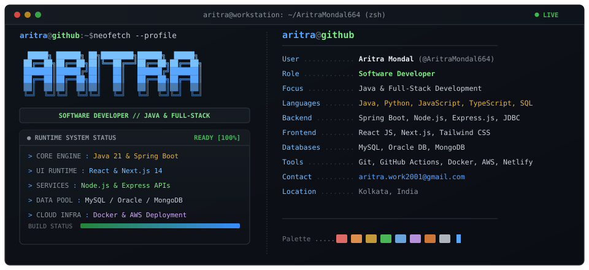
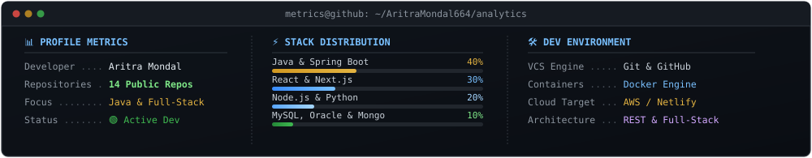

<div align="center">

<!-- HERO TERMINAL BANNER -->


</div>

```bash
aritra@github:~$ whoami

ARITRA MONDAL
Software Developer — Java & Full-Stack Systems

aritra@github:~$ focus

Java • Spring Boot • Python • React • Next.js • TypeScript • SQL • AWS • Docker
```

---

### 💻 `01_TECH_STACK`

```bash
aritra@github:~$ cat tech-stack.json
```

```json
{
  "programming": ["Java", "Python", "SQL", "C", "JavaScript", "TypeScript"],
  "backend":     ["Spring Boot", "Node.js", "Express.js", "JDBC", "REST APIs"],
  "frontend":    ["React JS", "Next.js", "Tailwind CSS", "HTML5", "CSS3"],
  "databases":   ["MySQL", "Oracle Database", "MongoDB"],
  "devops_tools":["Git", "GitHub Actions", "Docker", "AWS", "Netlify"]
}
```

<div align="left">

| Domain | Technologies & Frameworks |
| :--- | :--- |
| **Backend & Core** | `Java` `Spring Boot` `JDBC` `Node.js` `Express.js` `Python` `C` |
| **Frontend** | `React JS` `Next.js` `TypeScript` `JavaScript` `Tailwind CSS` `HTML5` `CSS3` |
| **Databases** | `MySQL` `Oracle Database` `MongoDB` `SQL` |
| **Tools & Cloud** | `Git` `GitHub Actions` `Docker` `AWS` `Netlify` |

</div>

---

### 📊 `02_SYSTEM_METRICS`

```bash
aritra@github:~$ systemctl status github-metrics.service
```

<div align="center">
  
</div>

---

### ⚡ `03_CURRENT_FOCUS`

```bash
aritra@github:~$ cat /etc/current-focus.conf
```

```yaml
Directives:
  - Java backend engineering & Spring Boot microservices
  - Relational & NoSQL database architecture (MySQL, Oracle, MongoDB)
  - Full-stack web application development (React / Next.js / TypeScript)
  - CI/CD automation & cloud deployments (GitHub Actions, Docker, AWS, Netlify)
```

---

### 📡 `04_CONNECT`

```bash
aritra@github:~$ cat contact.txt
```

```text
--------------------------------------------------------------------------------
PORTFOLIO ...... https://aritramondalportfolio.netlify.app/
LINKEDIN ....... https://www.linkedin.com/in/aritra-mondal-2b8a05363/
GITHUB ......... https://github.com/AritraMondal664
EMAIL .......... aritra.work2001@gmail.com
--------------------------------------------------------------------------------
```

<div align="center">
  <a href="https://aritramondalportfolio.netlify.app/"></a> <a href="https://www.linkedin.com/in/aritra-mondal-2b8a05363/"></a> <a href="https://github.com/AritraMondal664"></a> <a href="mailto:aritra.work2001@gmail.com"></a>
  <br/><br/>
  <sub>⚡ Monospace Terminal Dashboard • <b>Aritra Mondal</b></sub>
</div>
